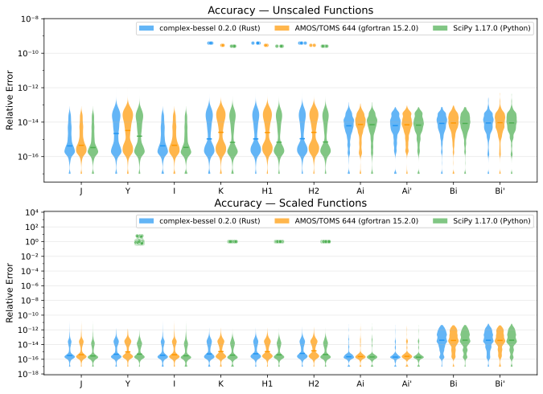
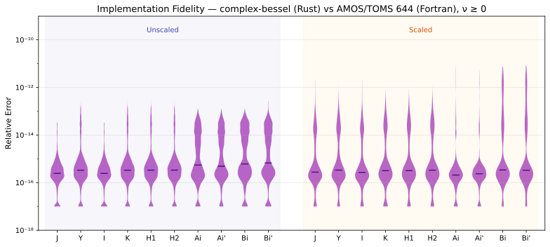
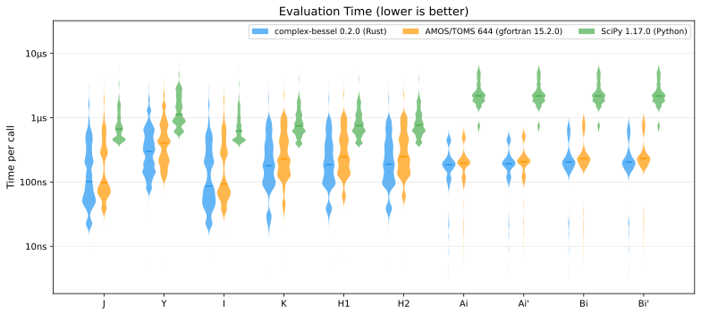

# complex-bessel-test

Accuracy and performance test suite for the [`complex-bessel`](https://github.com/elgar328/complex-bessel) Rust library, comparing against AMOS/TOMS 644 (Fortran), SciPy (Python), and mpmath (50+ digit precision ground truth).

## Accuracy

Relative error of complex-bessel (Rust), AMOS/TOMS 644 (Fortran), and SciPy (Python) versus mpmath 50+ digit reference values, across all Bessel and Airy functions. Lower is better.

[](images/accuracy.pdf)

> **Outliers in unscaled functions (K, H1, H2):**
> The points above 10<sup>-10</sup> come from near-zero results where the relative error is inherently amplified. All three implementations (Rust, Fortran, Python) show the same behavior.
>
> **Outliers in scaled functions (SciPy only):**
> K<sub>scaled</sub>, H1<sub>scaled</sub>, and H2<sub>scaled</sub> return zero in regions requiring analytic continuation — a code path (AMOS ZACON) that SciPy does not implement. Y<sub>scaled</sub> produces incorrect values near the real axis at large orders (ν ≥ 90), with relative errors up to 603%. Rust and Fortran handle both cases correctly.

## Implementation Fidelity (Rust vs Fortran)

Since `complex-bessel` is a Rust translation of AMOS/TOMS 644 (Fortran), the two should produce nearly identical results.

[](images/fidelity.pdf)

## Evaluation Time

Median evaluation time per function call, measured over 1000 repetitions per point. Lower is better. <!-- bench-speedup-start -->On average across all functions, the Rust implementation is **19% faster** than Fortran and **8× faster** than SciPy.<!-- bench-speedup-end -->

[](images/eval_time.pdf)

<!-- bench-env-start -->
> Measured on Apple M4 Max.
<!-- bench-env-end -->

## Summary

<!-- summary-table-start -->
**Unscaled Functions**

| Func | Points | Ok / Warn / Err | Match (%) | Rel Err | Time (μs) |
|:----:|:------:|:---------------:|:---------:|:-------:|:---------:|
| J | 28749 | 28747 / 0 / 2 | 100.0 | 4.2e-16 | 0.10 |
| Y | 28749 | 25512 / 0 / 3237 | 100.0 | 2.2e-15 | 0.32 |
| I | 28749 | 28747 / 0 / 2 | 100.0 | 4.2e-16 | 0.09 |
| K | 28749 | 25512 / 0 / 3237 | 100.0 | 1.1e-15 | 0.18 |
| H1 | 28749 | 25512 / 0 / 3237 | 100.0 | 1.1e-15 | 0.19 |
| H2 | 28749 | 25512 / 0 / 3237 | 100.0 | 1.1e-15 | 0.20 |
| Ai | 28749 | 28749 / 0 / 0 | 100.0 | 6.1e-15 | 0.19 |
| Ai' | 28749 | 28749 / 0 / 0 | 100.0 | 6.3e-15 | 0.20 |
| Bi | 28749 | 28749 / 0 / 0 | 100.0 | 8.5e-15 | 0.22 |
| Bi' | 28749 | 28749 / 0 / 0 | 100.0 | 8.9e-15 | 0.22 |

**Scaled Functions**

| Func | Points | Ok / Warn / Err | Match (%) | Rel Err | Time (μs) |
|:----:|:------:|:---------------:|:---------:|:-------:|:---------:|
| J | 13125 | 13125 / 0 / 0 | 100.0 | 3.2e-16 | 0.10 |
| Y | 13125 | 12273 / 0 / 852 | 100.0 | 4.8e-16 | 0.25 |
| I | 13125 | 13125 / 0 / 0 | 100.0 | 3.4e-16 | 0.08 |
| K | 13125 | 12273 / 0 / 852 | 100.0 | 5.2e-16 | 0.17 |
| H1 | 13125 | 12273 / 0 / 852 | 100.0 | 5.5e-16 | 0.17 |
| H2 | 13125 | 12273 / 0 / 852 | 100.0 | 6.2e-16 | 0.17 |
| Ai | 13125 | 12705 / 420 / 0 | 100.0 | 2.2e-16 | 0.16 |
| Ai' | 13125 | 12705 / 420 / 0 | 100.0 | 2.0e-16 | 0.17 |
| Bi | 13125 | 12705 / 420 / 0 | 100.0 | 3.9e-14 | 0.17 |
| Bi' | 13125 | 12705 / 420 / 0 | 100.0 | 3.8e-14 | 0.17 |

> **Points**: test grid points per function.  
> **Ok / Warn / Err**: result counts by status (Warn: reduced precision, Fortran IERR=3).  
> **Match**: Rust–Fortran agreement on Ok/Warn/Err status.  
> **Rel Err**: median relative error vs mpmath (50+ digit precision).  
> **Time**: median evaluation time per call.
<!-- summary-table-end -->

## Test Grid

The results above are computed on the following grid. Every function is evaluated over **all combinations** of order ν and argument z = Re + Im·i.
Unscaled functions use 21 × 37 × 37 = **28,749** points; scaled variants use 21 × 25 × 25 = **13,125** points; **41,874** points total.

```
ν (21): -2, -1.5, -0.5, 0, 0.25, 0.5, 1, 1.5, 2, 5, 10, 25, 50, 75, 85, 90, 100, 150, 200, 500, 1000
Unscaled Re, Im (37): -50, -40, -30, -25, -20, -15, -12, -10, -8, -6, -4, -3, -2, -1, -0.5, -0.1, -0.001, -1e-6, 0, 1e-6, 0.001, 0.1, 0.5, 1, 2, 3, 4, 6, 8, 10, 12, 15, 20, 25, 30, 40, 50
Scaled Re, Im (25): -1000, -500, -300, -200, -100, -50, -30, -10, -5, -1, -0.1, -0.01, 0.001, 0.01, 0.1, 1, 5, 10, 30, 50, 100, 200, 300, 500, 1000
```

## Running the Tests

See [docs/guide.md](docs/guide.md) for prerequisites, pipeline details, and usage instructions.
